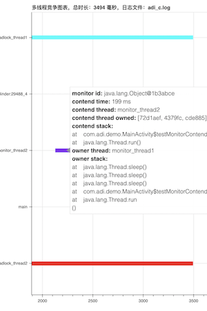
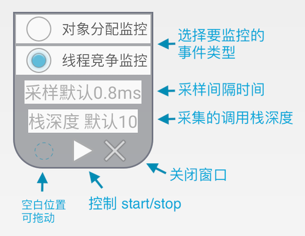
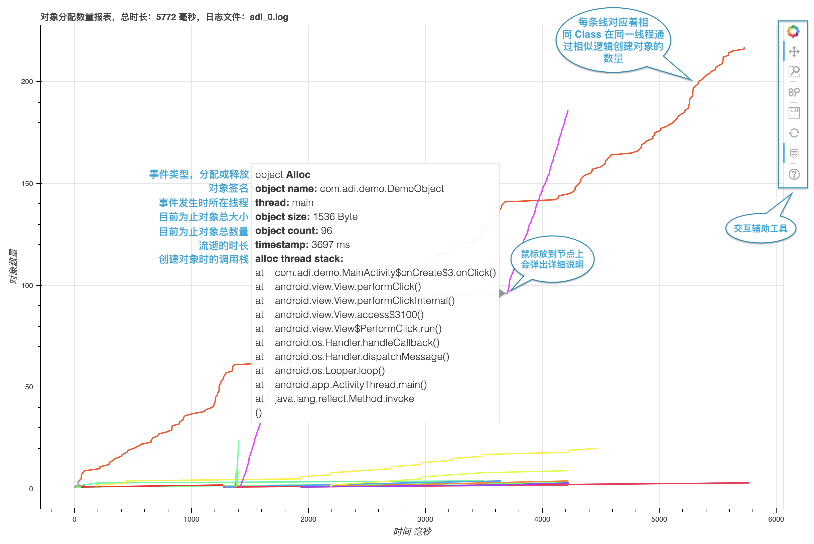

# ADI 简介

<p>
<table cellspacing="10">
<tr>

  <td>
  <a href="https://zkwlx.github.io/ADI/docs/adi_对象分配.html">
  
    <p/>对象分配图表 点击体验
  </a>

  </td>

  <td>
  <a href="https://zkwlx.github.io/ADI/docs/adi_线程竞争.html">
  
    <p/>线程竞争图表 点击体验
  </a>
  </td>

  <td>
  <a href="https://github.com/zkwlx/ADI/blob/master/docs/adi_screenshot.png">
  
    <p/>ADI 控制窗
  </a>
  </td>

</tr>
</table>
</p>

ADI(Android Debug Intensive) 是 Android 应用开发调试的增强工具集，目前主要提供性能相关的监控能力。  
ADI 对运行时的 App 进行性能数据收集，并提供工具用于生成分析图表。目前提供如下功能：
* 监控 ART 运行过程中对象的分配与释放，包括对象大小、创建对象调用栈等信息
* 监控 ART 运行过程中多线程之间的锁竞争，包括发生竞争时的调用栈、当前竞争线程的等待时长、当前持有锁的线程等信息
> 注意 ADI 只支持 Android 8.0（包括 8.0）之后的系统。
# 如何使用
### 集成到 APP
首先添加 jcenter 依赖（添加过请忽略）：
```gradle
buildscript {
    repositories {
        jcenter()
    }
}
allprojects {
    repositories {
        jcenter()
    }
}
```
然后 APP 工程集成 adi 库：
```gradle
implementation 'zkw.adi:adi:0.9.2'
```
### 生成 Log 文件
集成 adi 库之后便能够对 App 进行性能数据采集，采集方式有两种。
##### 方法一，使用 start/stop 接口
具体代码如下
```kotlin
// 首先进行初始化
ADIManager.init(context)
...
// 在任何想开始采集的地方添加如下代码
val builder = ADIConfig.Builder()
builder.setEventType(ADIConfig.Type.THREAD_MONITOR_CONTEND)// 设置要监控的事件类型
ADIManager.start(activity, builder.build())
...
// 在任何停止采集的地方添加如下代码
ADIManager.stop()
```
##### 方法二，可交互的悬浮控制窗
控制窗可以在不重新编译的情况下更改 ADI 配置，下面代码展示如何启动控制窗
```kotlin
// 在 Activity 中调用
ADIFloatManager.showADIFloat(activity)
```
控制窗的使用方法情参考图解



### 解析 Log 文件并生成图表
采集的内容存放在 `Context.getExternalCacheDir()`/ADI 目录下，例如
```bash
/sdcard/Android/data/APP 包名/cache/ADI/adi_1570605092.log
```
取出 log 文件后，使用`adi_analyze/adi_analyzer.py`分析 log 并生成图表，命令如下
> 使用 adi_analyzer.py 前请先安装 [bokeh](https://docs.bokeh.org/en/latest/docs/installation.html): `pip install bokeh`
```bash
python3 adi_analyzer.py ~/adi_1570605092.log
```
adi_analyzer.py 会创建 .html 结尾的图表文件，之后会自动启动浏览器打开图表文件，图表效果请参考封面。

# 功能详解
## 对象分配监控
在监控对象分配时，ADI 会监控所有 Java 层对象的创建事件，有几点需要注意：
* 频繁创建对象可能会导致 App 卡顿甚至卡死，可以通过 [ADIConfig.sampleIntervalMs](https://github.com/zkwlx/ADI/blob/master/adi_lib/adi/src/main/java/com/adi/ADIConfig.java#L68) 配置采样间隔（默认 0.8ms）
* 调用栈的深度默认是 10，可以通过 [ADIConfig.stackDepth](https://github.com/zkwlx/ADI/blob/master/adi_lib/adi/src/main/java/com/adi/ADIConfig.java#L68) 修改
* 如果生成的 Log 文件过大会严重影响图表生成时间，此时建议增加采样间隔或减少整体采样时长

ADI 会为对象事件的 Log 生成两个图表：对象分配数量图表和对象分配大小图表。下面用对象分配数量图表介绍下图表的使用方式。
<a href="https://zkwlx.github.io/ADI/docs/adi_对象分配.html">
 
 <p/>点击体验
</a>

## 多线程竞争监控
在监控多线程竞争时，ADI 会监控所有 Java 层 `synchronized` 关键字导致的多线程锁竞争事件，以下几点需要注意：
* 调用栈的深度默认是 10，可以通过 [ADIConfig.stackDepth](https://github.com/zkwlx/ADI/blob/master/adi_lib/adi/src/main/java/com/adi/ADIConfig.java#L68) 修改
* 如果生成的 Log 文件过大会严重影响图表生成时间，此时建议减少采样时长

多线程竞争图表的 Y 轴是发生竞争的线程名字，X 轴是时间，具体说明请看图解。

# License
```
Copyright 2019 Square, Inc.

Licensed under the Apache License, Version 2.0 (the "License");
you may not use this file except in compliance with the License.
You may obtain a copy of the License at

   http://www.apache.org/licenses/LICENSE-2.0

Unless required by applicable law or agreed to in writing, software
distributed under the License is distributed on an "AS IS" BASIS,
WITHOUT WARRANTIES OR CONDITIONS OF ANY KIND, either express or implied.
See the License for the specific language governing permissions and
limitations under the License.
```
