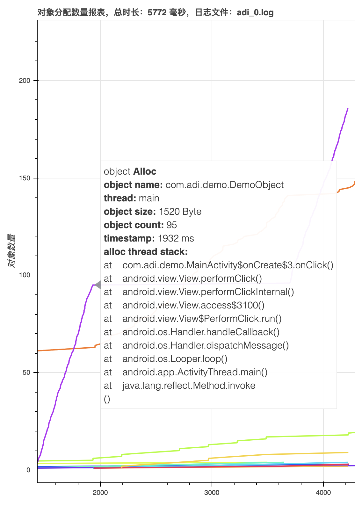
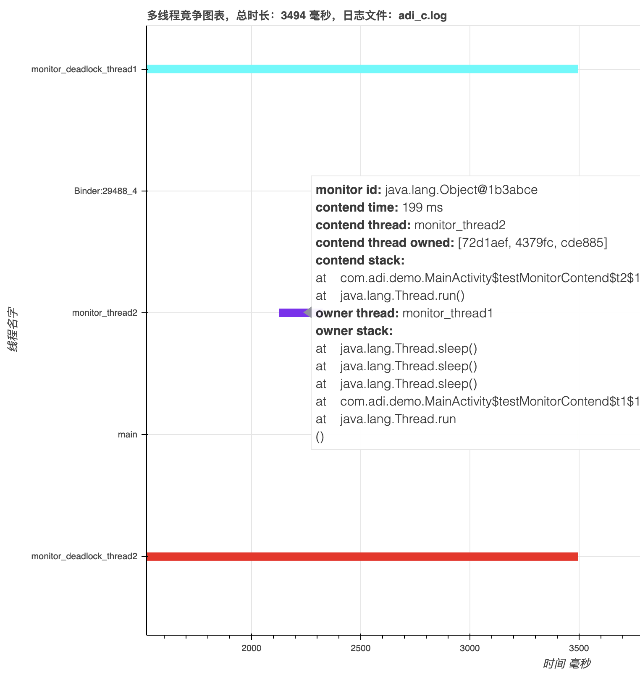

# ADI 简介

<p>
<table cellspacing="10">
<tr>

  <td>
  <a href="doc/adi_对象分配.html">
  
  </a>
  </td>

  <td>
  <a href="https://bokeh.pydata.org/en/latest/docs/gallery/anscombe.html">
  
  </a>
  </td>

  <td>
  <a href="https://bokeh.pydata.org/en/latest/docs/gallery/stocks.html">
  
  </a>
  </td>

</tr>
</table>
</p>

ADI(Android Debug Intensive) 是 Android 应用开发调试的增强工具集，目前主要提供性能相关的监控能力。
ADI 对运行时的 App 进行性能数据收集，并提供工具用于生成分析图表。目前提供如下功能：
* 运行时 JVM 对象分配、释放监控，包括对象大小、创建对象调用栈等信息
* 运行时 JVM 多线程竞争监控，包括发生竞争时的调用栈、当前竞争线程的等待时长、当前持有锁的线程等信息
# 如何使用
### 集成到 APP
### 生成 Log 文件
### 解析 Log 文件并生成图表
# 功能详解
## 对象分配监控
## 多线程竞争监控

# License
```
Copyright 2019 Square, Inc.

Licensed under the Apache License, Version 2.0 (the "License");
you may not use this file except in compliance with the License.
You may obtain a copy of the License at

   http://www.apache.org/licenses/LICENSE-2.0

Unless required by applicable law or agreed to in writing, software
distributed under the License is distributed on an "AS IS" BASIS,
WITHOUT WARRANTIES OR CONDITIONS OF ANY KIND, either express or implied.
See the License for the specific language governing permissions and
limitations under the License.
```
